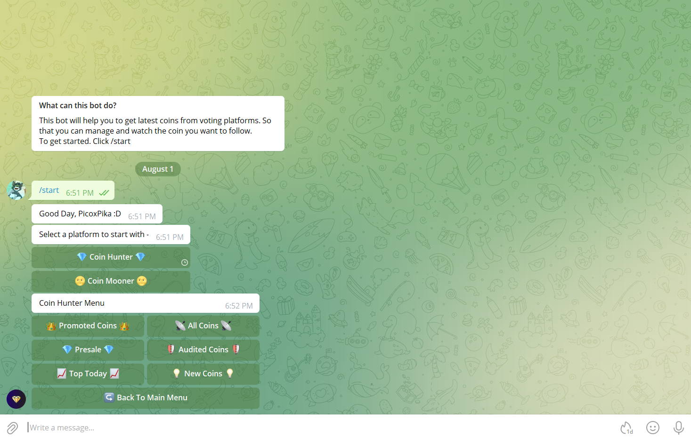

# Coin Watcher

A simple telegram bot using node js to scrap coins from voting sites and follow or manage them

### Technologies Used
- [Telegraf](https://github.com/telegraf/telegraf) to connect and interact with telegram bot api
- Node js [filesystem](https://nodejs.org/api/fs.html) api to read and write data
- Fetched api using [axios](https://github.com/axios/axios)

### Installation
Create a new bot and get your bot api from [Botfather](https://telegram.me/BotFather). Add it to `.env` and run -
- `npm install`
- `npm run start`

Ready to rock!